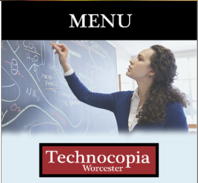

 
 
# About me

My name is Bezawit, but most people call me Beza. I am a senior who is a Computer Science & Economics double major studying at Clark University. This website contains an oveview of the diffrent designs & work I did in the past seven weeks for my last CS course called Human Computer Interaction, which I took at Worcester Polytech Institution. 

# Introduction

"Beauty is in the eye of the beholder". This is one of my favorite qoutes, in which I feel best depicts my views about design.Literal meaning - the perception of beauty is subjective. I stongly belive that design is a visual representation & product of ones preception of what they believe to be right. For the longest time I have belived that design is a choice that people make based on a bias they have. The Human Computer Interaction  course was a great way to help me inverstigate to what extent the bias of designers can affect their design & find out what are ways to avoid that from happening.

Through out the seven weeks of taking this course, I was assgined diffrent groups in which we created a variety of designs with a meaningful purpose. After each design project we were expected to write a medium post that captured our exprience, as well as how each phase of the design process (Ideation/brainstorming, Design, User testing, Refelection & Conclusion) impacted our final product. Each project had a purpose that met a unique goal

# Design for Others

Technocopia is a makerspace located in Worcester. Our task as a team was to redesign the Technocopia webpage into a mobile page that targeted K-12 teachers. The goal of redesigning the page was to target a demographic that would capture the eyes of teachers into motivating them to be apart of the Technocopia makerspace community in Worcester.

This project was one of my favortie ones becasuse it had a wide range of opportunities to be creative with design. For this design in particualr I was able to learn how to use photoshop for the diffrent pages I was recreating. Most of our design process and user testing with the demo phones was helpuf in helping us meet the goal of the project.
Some  techiniques I learnt from this design came from the following reading “Best Practices In User Experience (UX) Design” tools about becoming our users. So throughout editing the prototype, we would: Listen to their needs(In this case we tracked what suggestions our testers had) Observe them in their natural habitat. 

Medium post: https://medium.com/@kendog95/design-for-others-df0d936dbd40

## Design for Understanding

For this project our team decided to represent data about Nobel Prizes in two ways, Clear Communication and Persuasive Story telling.

For this porject our team applied the 5 Design sheet approach for our planning phase of the design process. This includes 1 sheet being the brainstorming 2,3,4 were our initial designs. Lastly sheet 5 was a realization sheet which was layout & anlysis all the designs. sheet which was a mostly a discussionIn regards to using the design sheets, for our group I would say it was not that effective because we spent a lot of time in building and figuring our the told to make the graphs as interactive as possible. However, the brainstorming sheet( sheet 1) was the most effective as it helped our group in organizing and reconsidering which graph could be more clear than persuasive. Even though the sheets were not as helpful as I imagined them to be, they were still a crucial part in building our graphs as they helped in organizing our ideas into effective groups.

Reflecting on our design process and the tools our team used, it took a lot of time for our team to figure out which tools to use, from using Vega Lite we also realized there might be better ways to effectively represent the type of graphs we wanted, this meant using the platform like Inforgram, which I thought to be a creative tool.

Medium post: https://medium.com/@bezawit.ayalew/design-for-understanding-f158f7615f15

## Design for Tension

The goal of this project was to create a chat box that helps the user realize weather they fit more in the Humanities or the Sciences.

The overall creation of a chat box was simple and to the point. The available tools were helpful in showing our team how we would like to implement our chat box. Inevitably, we wanted to create a chat box that didn’t limit us from further enhancements and therefore we implemented it from scratch. Our adjustments of the design of the chat box was driven by the feedback we received from the user. I particularly noticed the importance of user testing in this project as there were key points the users picked up on, that as the developers we did not notice.

Medium post: https://medium.com/@bezawit.ayalew/design-for-tension-humanities-vs-sciences-789c74aacae8

## Design for Wellbeing

Recognizing your emotions through facial recognition is a good way to detect if you are not having a good day. Using this idea our team created a website that detects 7 low energy emotions. If it detects one of the low emotions it displays a color & plays a song to promote wellbeing. The technology that we were using was Affectiva, which is a set of libraries that identifies user emotions by utilizing a webcam (for visual input).

The entire project was helpful in learning how to use Facial Recognition to promote mental health & wellbeing. Overall the most difficult part of the program other than the technical issues was trying to match a color to a specific mood, as people have different preferences on color and music choice. During the ideation phase of our design, our team kept circling around different music choices for the different emotions we were considering. At some points, we all had different preferences on the type of genre we would want to listen to for a given mood. This made me realize the importance of considering the fact that people have a different taste when it comes to music & color. This was significant to note during our design process as we had to be more selective when dealing with a more sensitive topic related to health & wellbeing.

Medium post: https://medium.com/@bezawit.ayalew/design-for-wellbeing-f67ed57501a1

## Design for Another World

The idea was to scare or instill fear in the user. While seemingly a horrible goal, studies show that being scared can be cathartic as there is a huge release of emotions. We decided to insert our concept instilling fear into an already established model from A-Frame. After scouring through, we determined the museum model best suited our concept. Our final idea was to create a haunted/corrupted museum that intended to scare. We made use of images, lighting, and music to accomplish this goal.
In general, we believe that our final design was produced to meet the requirements of the project. We placed the user into another world, placing them into a haunted museum. Our initial design for the project was to mimic the style of game play like in “Slender Man”, where the user would walk around the museum with an uneasy sound always following them. From here, we were thinking of implementing click functions for the various displays in the museum. The user would have a goal to touch or observe every display within the museum, awarding the user points or giving them a goal to observe as many displays as possible. If the user observed a certain display, or if the user took too long to observe the displays, there would be a jump scare implemented to scare the user. However, with the lack of time and lack of knowledge of coding 3D objects in HTML, we were unable to implement these click functions. In addition, we received user testing feedback about the lack of collisions and floating dots for some of the displays in the museum. We were unaware of this fact but could implement these functions for the future. Overall, we believe that our concept of placing the user into a haunted, “Slender Man” type game to be good but were restricted with our lack of technical prowess of coding in HTML and javascript.

Medium post: https://medium.com/@kendog95/design-for-another-world-af091294189d

# My Refecltion & Conclusion 

To answer my initial question which was to what extent can the bias of designers affect their design & if so what are good ways to avoid that from happening?

The 5 projects that I completed in Human Computer Interaction helped me understand that design can be bias in a lot of cases. I realized this from the very fisrt project. During our first user testing for Design for Others, every tester had a uniqie color suggestion very diffrent from each other for the mobile application. This shows that people choose color based on what they belive is right, this can depend on their upbringing and most importanly their expreiences. From this I learnt that it is very crucial during creating and designing a project to have diffrent users test it. Having diffrent users test your product as a designer helps you avoid making decisons based on your bias. Invetiablly the feedbacck you recieve from all users will help make a well rounded design decison. For this reason it is significant to say that taking Human Computer Interaction indeed did help me better answer my question.
